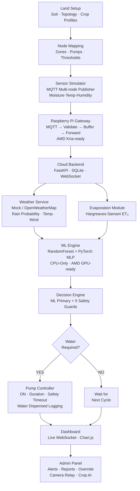

<<<<<<< HEAD
# SAMS — Smart Agriculture Monitoring System

<div align="center">

```
 ███████╗ █████╗ ███╗   ███╗███████╗
 ██╔════╝██╔══██╗████╗ ████║██╔════╝
 ███████╗███████║██╔████╔██║███████╗
 ╚════██║██╔══██║██║╚██╔╝██║╚════██║
 ███████║██║  ██║██║ ╚═╝ ██║███████║
 ╚══════╝╚═╝  ╚═╝╚═╝     ╚═╝╚══════╝
```


</div>

---

## Architecture



---

## 🗂️ Monorepo Structure

```
sams/
├── land_setup/              # Stage 1+2: Land profiling & node mapping
│   ├── schemas.py           # Pydantic models (FarmProfile, SoilData, ...)
│   ├── validator.py         # JSON profile validation
│   ├── calibration.py       # One-time sensor calibration
│   ├── node_mapper.py       # Zone ↔ pump ↔ sensor mapping
│   ├── profiles/
│   │   └── farm_001.json    # Sample farm (Green Valley, Tumkur)
│   └── zone_manifest.json   # Zone/pump/threshold config
│
├── edge/                    # Stage 3+4: Sensor simulator & Pi gateway
│   ├── sensor_simulator.py  # MQTT multi-node publisher (noise + drift)
│   ├── pi_gateway.py        # Raspberry Pi simulator (EdgeDevice abstraction)
│   ├── buffer.py            # Disk-backed offline queue
│   └── Dockerfile
│
├── cloud/                   # Stage 5+6: Cloud backend & weather
│   ├── main.py              # FastAPI app (REST + WebSocket)
│   ├── database.py          # Async SQLite ORM (SensorReading, Alert, ...)
│   ├── ws_manager.py        # WebSocket connection manager
│   ├── weather_service.py   # Mock/live weather with TTL cache
│   ├── routers/
│   │   ├── sensors.py       # Ingest, latest, history
│   │   ├── irrigation.py    # Events, manual override
│   │   ├── alerts.py        # CRUD + acknowledge
│   │   └── admin.py         # Reports, crop AI, market prices, camera
│   ├── requirements.txt
│   └── Dockerfile
│
├── ml_engine/               # Stage 7+8: Evaporation & ML pipeline
│   ├── evaporation.py       # Hargreaves-Samani ET₀ computation
│   ├── dataset_generator.py # 5K synthetic training samples
│   ├── train_rf.py          # RandomForest classifier + regressor
│   ├── train_torch.py       # PyTorch dual-head MLP
│   ├── train_all.py         # Unified training entry point
│   ├── predictor.py         # IrrigationPredictor (RF & Torch)
│   ├── models/              # Saved model artifacts
│   └── Dockerfile
│
├── decision_engine/         # Stage 9+10: Hybrid decision logic
│   ├── engine.py            # 5-guard ML + rule hybrid engine
│   └── water_check.py       # is_water_required() service
│
├── pump_control/            # Stage 11+12: Pump & scheduler
│   ├── controller.py        # Simulated pump (ON/OFF/timeout/logging)
│   └── scheduler.py         # Async state machine scheduler
│
├── dashboard/               # Stage 13: Web dashboard
│   └── index.html           # B&W monochrome SPA (WebSocket + Chart.js)
│
├── admin_panel/             # Stage 14: Admin & intelligence layer
│   └── index.html           # 7-page admin SPA (alerts, reports, override)
│
├── infra/                   # Infrastructure config
│   ├── mosquitto.conf       # MQTT broker config
│   ├── nginx.conf           # Dashboard/admin reverse proxy
│   └── logging_config.py    # Structured JSON logging (structlog)
│
├── tests/                   # Pytest test suite
│   ├── test_land_setup.py
│   ├── test_evaporation.py
│   ├── test_decision_engine.py
│   ├── test_pump_controller.py
│   ├── test_weather_service.py
│   └── test_cloud_api.py
│
├── docker-compose.yml       # Full orchestration
├── .env.example             # Configuration template
├── requirements.txt         # Unified dev requirements
├── pytest.ini
└── README.md
```

---

## 🚀 Quick Start

### Option A — Docker (Recommended)

```bash
# 1. Copy environment config
cp .env.example .env

# 2. Start all services
docker compose up --build

# 3. Open dashboard
# http://localhost:3000  → Live Dashboard
# http://localhost:3001  → Admin Panel
# http://localhost:8000/docs → API Reference
```

### Option B — Local Development

```bash
# Install all dependencies
pip install -r requirements.txt

# Terminal 1: Start cloud backend
cd e:/smart-agriculture-monitoring
uvicorn cloud.main:app --reload --port 8000

# Terminal 2: Start MQTT broker (Docker)
docker run -d -p 1883:1883 eclipse-mosquitto:2.0

# Terminal 3: Start edge sensor simulator
python -m edge.sensor_simulator

# Terminal 4: Start Pi gateway
python -m edge.pi_gateway

# Open dashboard/index.html in browser
```

### Train ML Models

```bash
# Option A: Docker (profile)
docker compose --profile train up ml_trainer

# Option B: Local
python ml_engine/train_all.py
```

---

## 🧪 Running Tests

```bash
# Install test deps
pip install pytest pytest-asyncio anyio httpx

# Run all tests
pytest tests/ -v --tb=short

# Run specific module
pytest tests/test_decision_engine.py -v
pytest tests/test_cloud_api.py -v
```

---

## 🔄 Pipeline Stages

| Stage | Module | Description |
|-------|--------|-------------|
| 1 | `land_setup/` | Farm profiles, soil/topology/crop data |
| 2 | `land_setup/node_mapper.py` | Zone → sensor → pump mapping |
| 3 | `edge/sensor_simulator.py` | MQTT multi-node sensor publisher |
| 4 | `edge/pi_gateway.py` | Raspberry Pi gateway with buffer/retry |
| 5 | `cloud/` | FastAPI cloud backend + WebSocket |
| 6 | `cloud/weather_service.py` | Weather API with mock mode + cache |
| 7 | `ml_engine/evaporation.py` | Hargreaves-Samani ET₀ computation |
| 8 | `ml_engine/` | RandomForest + PyTorch predictor |
| 9 | `decision_engine/engine.py` | Hybrid ML + 5-guard decision engine |
| 10 | `decision_engine/water_check.py` | `is_water_required()` service |
| 11 | `pump_control/controller.py` | Simulated pump with safety timeout |
| 12 | `pump_control/scheduler.py` | Async state machine scheduler |
| 13 | `dashboard/` | Live WebSocket dashboard |
| 14 | `admin_panel/` | Alerts, reports, override, camera |

---

## ML Pipeline

- **Features**: `soil_moisture`, `temperature_c`, `humidity_pct`, `wind_speed_mps`, `rain_probability`, `et0_mm_day`, `crop_type_enc`, `soil_type_enc`
- **Outputs**: `irrigation_needed (bool)`, `confidence (0–1)`, `recommended_duration_minutes (int)`
- **Models**: RandomForest (baseline) + PyTorch MLP dual-head (classification + regression)
- **Training**: `python ml_engine/train_all.py` → saves to `ml_engine/models/`

### Decision Guards

| Guard | Trigger | Effect |
|-------|---------|--------|
| Rain Suppression | Rain probability ≥ 60% | Skip irrigation |
| Cooldown | Recent irrigation within 15 min | Skip cycle |
| Anomaly Detection | Z-score > 3.0 on moisture | Reject reading |
| Threshold Override Low | Moisture < 75% of threshold | Force irrigate |
| Threshold Override High | Moisture > 150% of threshold | Force skip |

---

## AMD Future Roadmap

| Current | Future | Path |
|---------|--------|------|
| Raspberry Pi 4B | AMD Kria KV260 SOM | Replace `RaspberryPiDevice` with `KriaSOMDevice` in `edge/pi_gateway.py` |
| CPU Inference (PyTorch) | AMD Instinct GPU | Change `device = torch.device("cuda")` in `train_torch.py` + `predictor.py` |
| Standard Edge | Versal AI Edge | Extend `EdgeDevice` interface for AIE-based model serving |

The `EdgeDevice` abstract base class in `edge/pi_gateway.py` is designed exactly for this migration path.

---

## API Reference

| Method | Endpoint | Description |
|--------|---------|-------------|
| `GET` | `/health` | System health check |
| `POST` | `/api/v1/sensors/ingest` | Ingest sensor reading |
| `GET` | `/api/v1/sensors/latest` | Latest reading per node |
| `GET` | `/api/v1/sensors/history/{node_id}` | Time-series history |
| `POST` | `/api/v1/irrigation/start` | Record irrigation start |
| `POST` | `/api/v1/irrigation/end` | Record irrigation end |
| `POST` | `/api/v1/irrigation/manual-override` | Manual trigger/stop |
| `GET` | `/api/v1/alerts/` | List alerts |
| `POST` | `/api/v1/alerts/{id}/acknowledge` | Acknowledge alert |
| `GET` | `/api/v1/weather` | Weather forecast |
| `GET` | `/api/v1/admin/reports/irrigation-summary` | Irrigation report |
| `GET` | `/api/v1/admin/reports/crop-recommendations` | AI crop advice |
| `GET` | `/api/v1/admin/reports/market-prices` | Market pricing |
| `GET` | `/api/v1/admin/camera/events` | Camera event stream |
| `WS` | `/ws/stream` | Real-time WebSocket feed |

---

## Environment Variables

See `.env.example` for the full list. Key variables:

```env
WEATHER_MODE=mock           # mock | live
SENSOR_PUBLISH_INTERVAL=5   # seconds between sensor readings
COOLDOWN_MINUTES=15         # anti-flap cooldown
ML_MODEL_TYPE=rf            # rf | torch
CYCLE_DELAY_SECONDS=30      # scheduler cycle
```
=======

>>>>>>> adedcefae8a1fecc57343b983e0a699266bbff48
